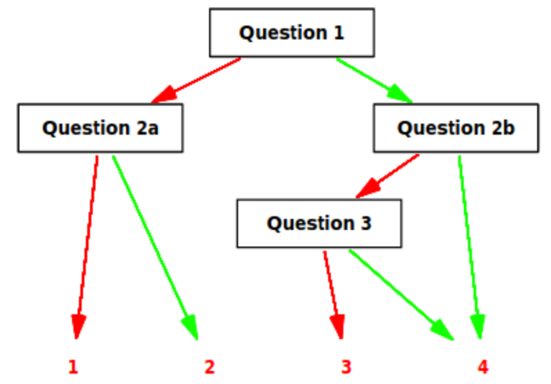

```{r setup, include=FALSE}
knitr::opts_chunk$set(echo = TRUE, message = FALSE, warning = FALSE, error = FALSE)
```

## R Markdown

The following presents results of Berlin Numeracy Test (BNT) conducted as part of [Risk perception of COVID-19/coronavirus survey](https://doi.org10.17605/OSF.IO/JNU74) by arranged by Winton Centre for Risk and Evidence Communication in 2020. To the best of my knowledge this is the first open publication of BNT data since Cockely at al (2012).
                             )

```{r import_data}
library(tidyverse)
dt <- read_csv("data/WintonCentreCleaned_covid_11country_plusUK2_labelled.csv")

qs <- c("Num1", "Num2a", "Num2b", "Num3")
# Add "NumeracyQ1" separately

correct_df <- tibble::tribble(~var, ~code, ~corr, ~grp,
                              "Num1", 25L, TRUE, 3L,
                              "Num2a", 30L, TRUE, 2L,
                              "Num2b", 20L, TRUE, 4L,
                              "Num3", 50L, TRUE, 4L)
```

We are going to look at the four variables constituting BNT. This is adaptive test, so not all people answer every question. Objective is to classify respondent into 4 groups with minimum number of questions involved. The following illustration from Cockely et al (2012) illustrates the data collection process.

 

```{r wrangle_data}
q_df <- dt %>% 
  slice(1:2) %>% select(-version) %>% 
  tibble::rowid_to_column() %>% 
  pivot_longer(-rowid, names_to = "var", 
               values_to = "txt_en") %>% 
  filter(var %in% qs, rowid==1) %>% 
  select(-rowid)

data_lng_df <- dt %>% 
  slice(-1:-3) %>% select(-version) %>% 
  tibble::rowid_to_column() %>% 
  pivot_longer(cols = GenSocTrust:Politics, 
               names_to = "var", values_to = "code") %>% 
  filter(var %in% qs) %>% 
  arrange(rowid, var) %>% 
  mutate(code=ifelse(as.numeric(code)<1, 
                     as.integer(as.numeric(code)*100), 
                     as.integer(code))) %>% 
  left_join(correct_df, by=c("var", "code")) %>% 
  replace_na(list(corr=FALSE, grp=1)) %>%
  filter(!is.na(code)) %>% 
  group_by(rowid) %>% 
  mutate(grp=max(grp),
         corr=ifelse(corr, "right", "wrong")) %>% 
  ungroup()
```

The paper claims that "the structure of the Computer Adaptive BerlinNumeracy  Test.   Each  question  has  a  50%  probably  of being right/wrong. If a question is answered right/wronga harder/easier question is provided that again has a 50% probability of being right/wrong". The following chart presents right and wrong answer counts to each question mapped to the test protocol above.

```{r, fig.width=10, fig.height=10}
library(patchwork)

theme_set(hrbrthemes::theme_ipsum_rc(grid = FALSE)) 

p_num1 <- data_lng_df %>% 
  filter(var=="Num1") %>% 
  ggplot(aes(x=fct_rev(corr), fill=fct_rev(corr)))+
  geom_bar(show.legend = FALSE)+
  scale_fill_manual(values = c("right"="#1f487e", "wrong"="#ef271b"))+
  labs(subtitle="Num1: Mens choir", x=NULL)

p_num2a <- data_lng_df %>% 
  filter(var=="Num2a") %>% 
  ggplot(aes(x=fct_rev(corr), fill=fct_rev(corr)))+
  geom_bar(show.legend = FALSE)+
  annotate("text", x="wrong", y=200, label="1", family="Roboto Mono", color="white", size=5)+
  annotate("text", x="right", y=200, label="2", family="Roboto Mono", color="white", size=5)+
  scale_fill_manual(values = c("right"="#c64038", "wrong"="#f36e66"))+
  labs(subtitle="Num2a: Odd dice",x=NULL)

p_num2b <- data_lng_df %>% 
  filter(var=="Num2b") %>% 
  ggplot(aes(x=fct_rev(corr), fill=fct_rev(corr)))+
  geom_bar(show.legend = FALSE)+
  scale_fill_manual(values = c("right"="#17355c", "wrong"="#993955"))+
  labs(subtitle="Num2b: Loaded dice",x=NULL)


p_num3 <- data_lng_df %>% 
  filter(var=="Num3") %>% 
  ggplot(aes(x=fct_rev(corr), fill=fct_rev(corr)))+
  geom_bar(show.legend = FALSE)+
  annotate("text", x="wrong", y=200, label="3", family="Roboto Mono", color="white", size=5)+
  scale_fill_manual(values = c("right"="#0c1b2e", "wrong"="#993955"))+
  labs(subtitle="Num3: Poisonous mushrooms",x=NULL)

p_num3f <- data_lng_df %>% 
  filter(var=="Num2b", corr=="right") %>% 
  ggplot(aes(x=fct_rev(corr), fill=fct_rev(corr)))+
  geom_bar(show.legend = FALSE)+
   annotate("text", x="right", y=200, label="4", family="Roboto Mono", color="white", size=5)+
  scale_fill_manual(values = c("right"="#0c1b2e", "wrong"="#ffffff"))+
  labs(x=NULL)

p_num1/(p_num2a|(p_num2b/(p_num3|p_num3f)))+
  plot_annotation(title="Berlin Numeracy Test", 
                  subtitle = "Share of people who answered each question correctly",
                  caption = "Source:Winton Centre for Risk and Evidence Communication, 2020
                             https://doi.org10.17605/OSF.IO/JNU74")

```

In other words, in this sample, most of the questions (except for Num2b) were considered difficult for participants, with probabilities being significantly below 50%.

```{r}
data_lng_df %>% 
  group_by(var, corr) %>% 
  summarise(n=n()) %>% 
  ggplot()+
  geom_col(aes(y=var, x=n, fill=corr), position="fill")
```


## References

Cokely, E. T., Galesic, M., Schulz, E., Ghazal, S., & Garcia-Retamero, R. (2012). Measuring risk literacy: The Berlin numeracy test. Judgment and Decision making.

Lindskog, M., Kerimi, N., Winman, A., & Juslin, P. (2015). A Swedish validation of the Berlin numeracy test. Scandinavian journal of psychology, 56(2), 132-139.
